# EX 2 - Cloud storage creation (S3) and launching an (Ec2) instance in AWS
### NAME : HARINI R
### REG NO : 212223100010
## Aim:
To create a Simple Storage Service (S3) in AWS and to launch an EC2 instance in AWS.

## Procedure and Output:
### Step 1: Choose S3 Service
Choose the S3 service from the list of services provided by AWS.

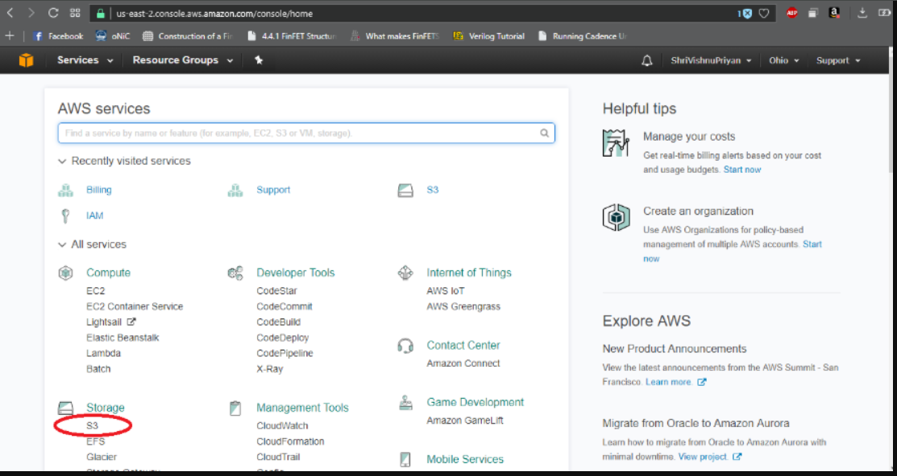

### Step 2: Create a Unique Bucket
After selecting the S3 service, click on the "Create Bucket" button on the page. The bucket name must be unique, contain no uppercase letters, and have no special characters. If you enter any of these, an error will display, preventing the bucket from being created.

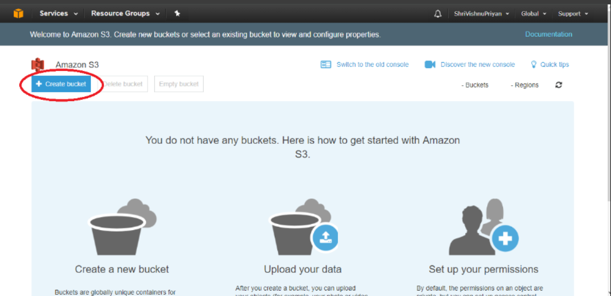

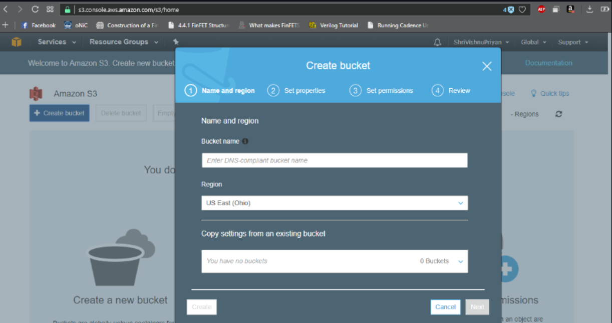

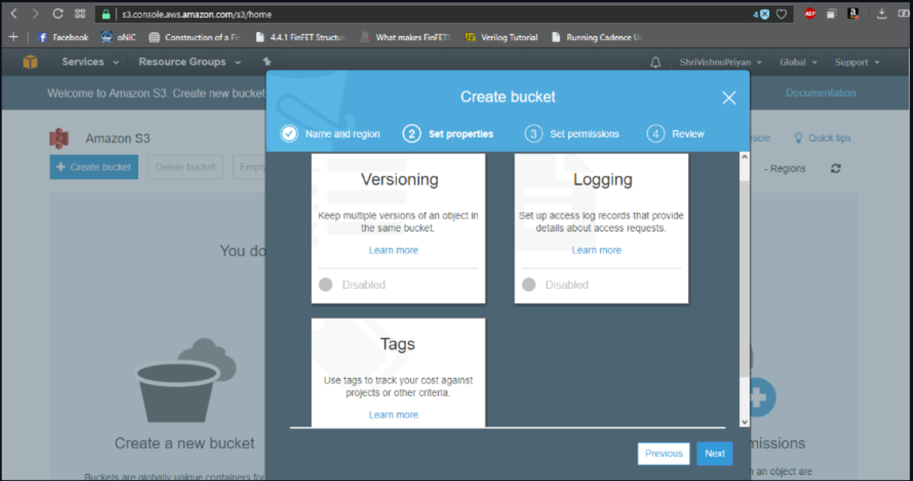

For region selection, choose a region from the available list. It is recommended to select a region nearby your location for higher availability. In this lab, I selected Sydney, as it is near my country, New Zealand. Remember to provide a unique bucket name with no special characters or uppercase letters.

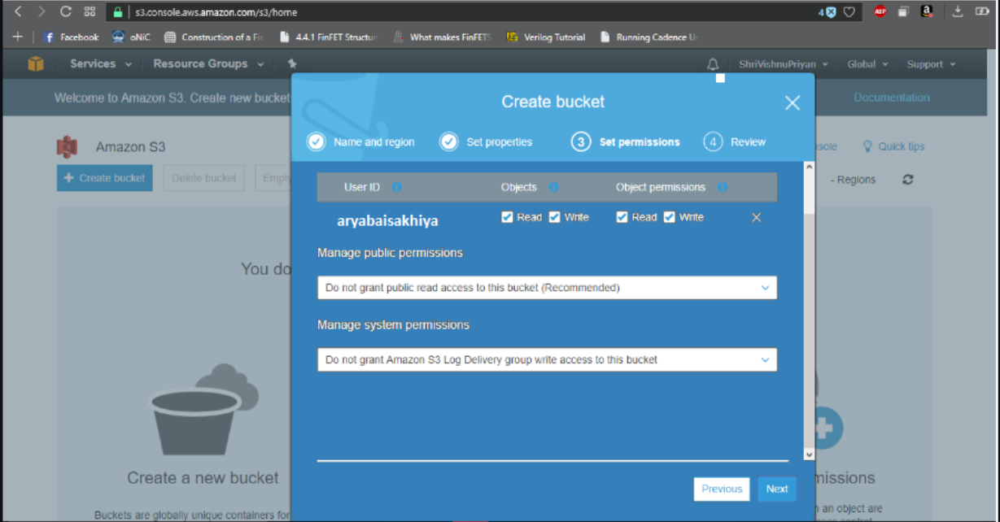

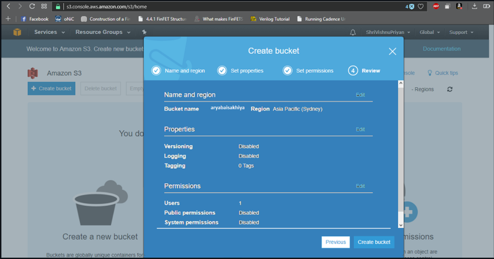

### Step 3: Upload Files to the Bucket
Now, I have uploaded some files into the bucket I just created. There are no restrictions on uploading file types, but the size of each file must be less than 5 terabytes.

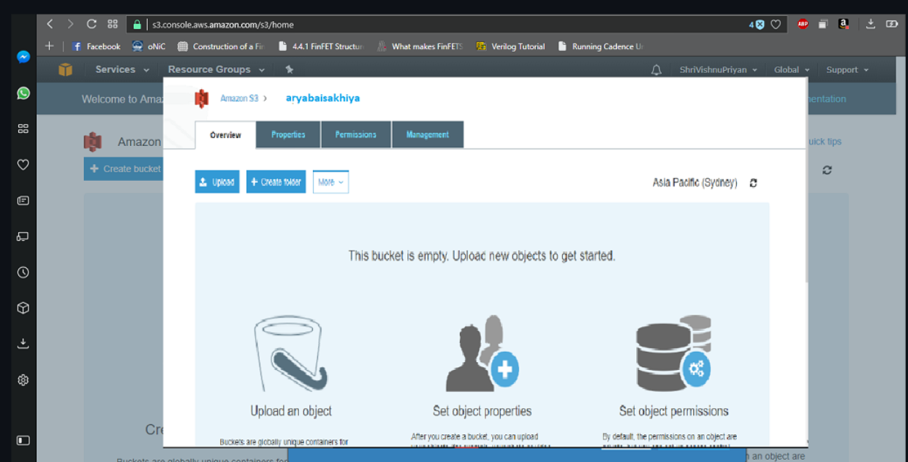

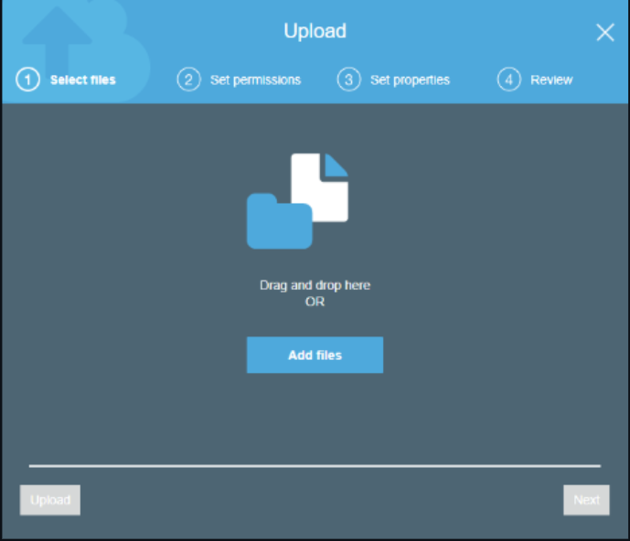

You can upload files of any extension, folders, and subfolders. The images below explain that you can drag and drop files or select them from your computer. After uploading a file, you can download, cut, copy, make it public, rename, or delete it. Making a file public means everyone can access it, and you will receive a link (e.g., https://s3-ap-southeast-2.amazonaws.com/...) to share it.

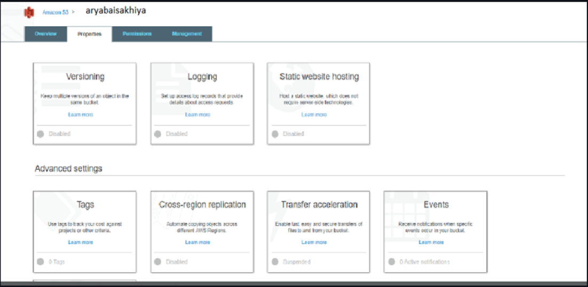

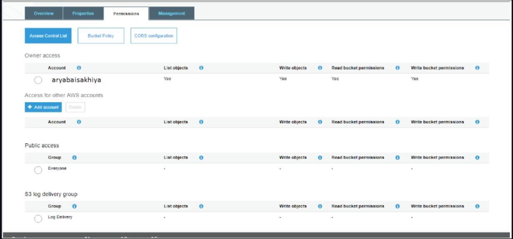

### Step 4: Upload a Folder
You can also upload a folder to the bucket. If your local folder contains subfolders and data, all data inside the parent folder will be uploaded. The images below show how to upload a folder by dragging and dropping or browsing.

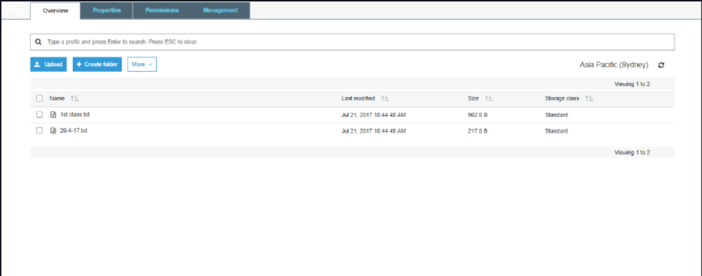

### Step 5: Delete the Bucket
To delete a bucket, you must retype the bucket name. This policy is implemented by Amazon to confirm your action because deleting a bucket can remove large amounts of data.

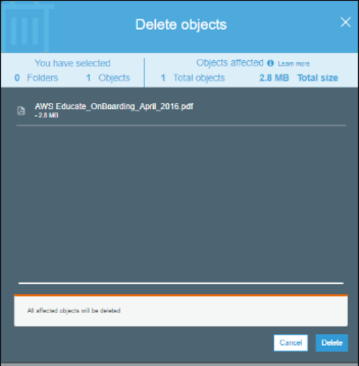

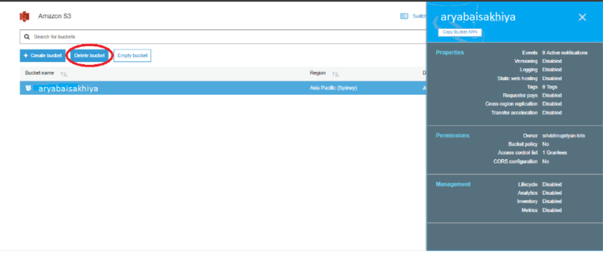

## Result:
Thus, a Simple Storage Service (S3) and EC2 (Elastic Compute Cloud) - instance has been successfully created and launched in AWS